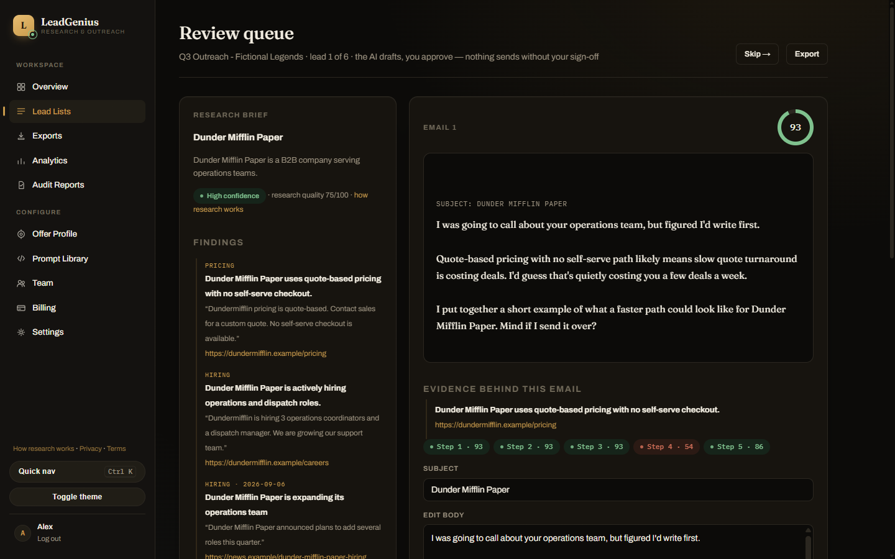
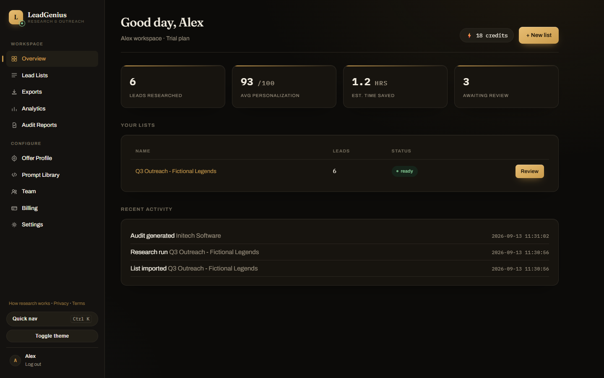
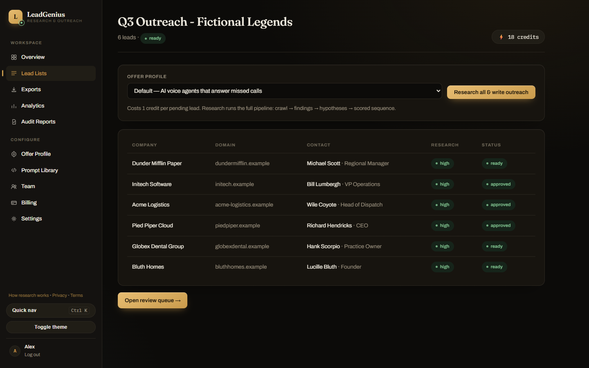
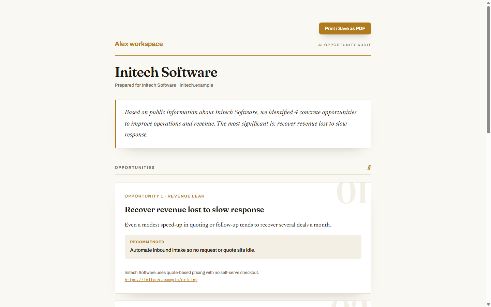
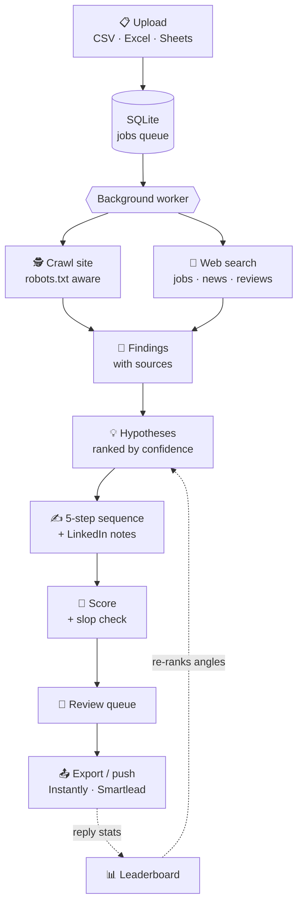

<div align="center">

<a href="https://leadgenius-demo.onrender.com/signup">
  
</a>

<br><br>

<a href="https://leadgenius-demo.onrender.com/signup"></a>


### Pick your path

**🙋 New here?** [What is this?](#-what-is-leadgenius) &nbsp;·&nbsp;
**👀 Want to see it?** [Live demo](https://leadgenius-demo.onrender.com/signup) &nbsp;·&nbsp;
**🎮 Got 30 seconds?** [Play the game](#-play-spot-the-reply) &nbsp;·&nbsp;
**💻 Developer?** [Run it locally](#-run-it-yourself)

</div>

<br>

## 💡 What is LeadGenius?

**The no-jargon version.**

Say you sell something to other businesses, and you have a list of 200 companies you'd love as customers.

The usual move is to send all 200 the same email with their name pasted in. People can tell. Most of those emails get deleted in about three seconds.

The move that works is to **research each company first**. You read their website, notice they're hiring, see that their pricing page makes you call for a quote, and write a short note about *that*. People reply to emails like that. The catch is that it takes about 15 minutes per company, so almost nobody does it.

**LeadGenius does that homework for you, for every company on your list.**

<table>
<tr>
<td align="center" width="25%">📋<br><b>1. You upload a list</b><br><sub>A spreadsheet of companies. CSV, Excel, a Google Sheets link, or an export from Apollo or Clay.</sub></td>
<td align="center" width="25%">🕵️<br><b>2. It does the research</b><br><sub>Reads each company's website and searches for job posts, news and reviews. Every fact is saved with the page it came from.</sub></td>
<td align="center" width="25%">💡<br><b>3. It finds the angle</b><br><sub>Works out the most likely business problem, like <i>"quotes need a sales call, so they're probably slow."</i></sub></td>
<td align="center" width="25%">✍️<br><b>4. It writes. You approve.</b><br><sub>A short 5-email sequence plus LinkedIn notes, each scored out of 100. Nothing goes anywhere without your OK.</sub></td>
</tr>
</table>

> [!TIP]
> **The one-sentence version:** you give it a list of companies, and it gives you back emails that sound like you spent an afternoon on each one.

<br>

## 🎬 See it in action

<div align="center">
  
  <br>
  <sub>A replay of the live research feed. The companies are fictional. The pipeline is not.</sub>
</div>

<br>

<table>
<tr>
<td width="50%" valign="top">

<p><b>🔍 The review queue.</b> Research on the left, the email on the right, and the evidence behind every claim underneath. Approve with a single key.</p>
</td>
<td width="50%" valign="top">

<p><b>📊 Your dashboard.</b> Leads researched, average personalization score, hours saved, and what's waiting for you.</p>
</td>
</tr>
<tr>
<td width="50%" valign="top">

<p><b>📋 Lead lists.</b> Upload once, research everything in one click, and see a confidence level for every lead.</p>
</td>
<td width="50%" valign="top">

<p><b>📑 AI Opportunity Audits.</b> A branded, print-ready report on one company. Agencies sell these to their own clients.</p>
</td>
</tr>
</table>

> [!NOTE]
> **The live demo uses real AI and real web research.** [Create a free account](https://leadgenius-demo.onrender.com/signup) (or [log in](https://leadgenius-demo.onrender.com/login)), upload a few companies you know, and watch it work. If the first load takes a moment, the server is just waking up.

<br>

## 🎮 Play: spot the reply

Two emails to the same person, the head of dispatch at a logistics company. One got deleted. One got a reply.

**Which is which?**

<table>
<tr>
<td width="50%" valign="top">

#### 📨 Email A

> **Subject:** Quick question!
>
> Hi Wile,
>
> I hope this email finds you well! I came across your amazing website and was really impressed by what your team is doing. We help companies like yours supercharge their operations with cutting-edge AI.
>
> Would love to touch base. Do you have 15 minutes this week? You can book a call here.

</td>
<td width="50%" valign="top">

#### 📨 Email B

> **Subject:** Acme Logistics
>
> I was going to call about your dispatch team, but figured I'd write first.
>
> You're hiring 3 dispatchers, and quotes still go through email. I'd guess slow quotes are quietly costing you a few deals a week, especially when a shipper wants a price today and the first carrier to answer gets the load.
>
> I put together a short example of what a faster quote flow could look like for Acme, including how the dispatch team would handle the requests that still need a human. It takes about two minutes to read.
>
> Mind if I send it over?

</td>
</tr>
</table>

<details>
<summary><b>🤔 Made your guess? Click to reveal the answer.</b></summary>

<br>

### It's Email B. (You knew that.)

We ran both emails through LeadGenius's actual scoring code. Here's what it saw:

| Scoring check | Email A | Email B |
|---|:---:|:---:|
| 🧾 **Uses a real fact from research** | ❌ 6 / 25 | ✅ 25 / 25 |
| 🧹 **Free of cliché phrases** | ❌ 0 / 20 <br><sub>8 banned phrases found</sub> | ✅ 20 / 20 |
| 🙋 **Ends with an easy question** | ❌ 3 / 10 <br><sub>"book a call" is a big ask</sub> | ✅ 10 / 10 |
| 🎯 Specificity and ✂️ length | same | same |
| **Final score** | 🔴 **47 / 100** | 🟢 **93 / 100** |

Email A could be sent to any company on Earth, and that's exactly why it gets deleted. Email B could only be sent to one company.

LeadGenius writes Email B by default. The 5-step structure it uses comes from a real campaign that got **45 replies from 278 leads (16.2%)**. A typical cold campaign gets under 2%.

</details>

<br>

## 🧹 The Slop Detector

<div align="center">
  
</div>

<br>

Every email LeadGenius writes is graded out of 100 before you see it. Nothing is hidden. You can see the score, the reasons behind it, and the sources.

| Check | Points | What it's looking for |
|---|:---:|---|
| 🎯 Specificity | 30 | Something that's only true about *this* company |
| 🧾 Evidence | 25 | A fact pulled from the research, with a link to where it came from |
| 🧹 No slop | 20 | Loses 7 points for every banned cliché |
| ✂️ Brevity | 15 | 100 to 170 words, six short paragraphs at most |
| 🙋 Soft ask | 10 | Ends on an easy question, not "book a call" or a Calendly link |

<details>
<summary><b>🎯 Play Slop Bingo: see every banned phrase</b></summary>

<br>

Open your inbox. Every phrase you find is a square. Get a full row and you win absolutely nothing, except proof that someone out there is using the wrong tool.

| B | I | N | G | O |
|:---:|:---:|:---:|:---:|:---:|
| I came across your... | Hope this email finds you well | Hope you're doing well | I noticed you... | Your amazing website |
| Revolutionize | Supercharge | 🆓 `{{first_name}}` | Unleash | Game-changer |
| Cutting-edge | Synergy | Circle back | Touch base | I wanted to reach out |
| I hope this message finds you | To whom it may concern | Dear sir or madam | We are excited to | Loved your recent post |

</details>

<br>

## 👥 Who is it for?

Pick the one that sounds like you.

<details>
<summary><b>🏢 I run an agency</b></summary>

<br>

Your team writes the first lines, and it shows. With LeadGenius, every lead gets researched, reviewers clear the queue from the keyboard, and **white-label AI Opportunity Audits** give you something new to sell. Clients pay for a custom report on their business, and LeadGenius builds it from research in minutes. Team seats and roles let you control who can edit, approve, or only review.

</details>

<details>
<summary><b>🚀 I'm a founder doing my own sales</b></summary>

<br>

You don't have time to research 200 companies, and you don't want to sound like a bot. Upload your list on Monday, review a queue of emails that already cite real facts, and export to Instantly or Smartlead. Most of the work is approving.

</details>

<details>
<summary><b>📈 I lead a sales team</b></summary>

<br>

Your reps spend hours on research before a single email goes out. LeadGenius does that part and scores every draft, so reps only review. Import reply stats later and the **hypothesis leaderboard** shows which angles actually get replies. Future emails lean toward the winners automatically.

</details>

<details>
<summary><b>🎯 I'm a recruiter or consultant</b></summary>

<br>

You don't need 1,000 emails, you need 20 great ones. LeadGenius gives each company the attention of a real research session, then drafts outreach you'd be proud to sign.

</details>

<br>

## ✨ What's inside

<table>
<tr>
<td width="33%" valign="top">

### 🕵️ Deep research
Reads up to 15 pages per website, then searches for job posts, funding news, reviews and press. It even detects the tech a company uses.

</td>
<td width="33%" valign="top">

### 🧾 Receipts for every line
Every finding stores its source URL and the exact quote. If a claim can't be matched to the source, it gets dropped.

</td>
<td width="33%" valign="top">

### 📡 Live research feed
Watch findings stream in as they happen. No mystery progress bar.

</td>
</tr>
<tr>
<td valign="top">

### ⌨️ Keyboard-first review
Approve, regenerate, edit, and move between leads without touching the mouse. <kbd>Ctrl</kbd>+<kbd>K</kbd> jumps anywhere.

</td>
<td valign="top">

### 📤 Export or push
Download CSVs formatted for Instantly or Smartlead, or push campaigns straight to them. LeadGenius never sends email itself.

</td>
<td valign="top">

### 📊 Learns what works
Pull reply stats back in. The leaderboard ranks which angles get replies, and new leads get re-ranked to match.

</td>
</tr>
<tr>
<td valign="top">

### 📑 White-label audits
One-company opportunity reports with your brand, colors and contact details. Save as PDF straight from the browser.

</td>
<td valign="top">

### 👥 Teams and roles
Owner, admin, member and reviewer roles, invite links, and seat limits per plan.

</td>
<td valign="top">

### ✏️ Editable prompts
11 prompt slots (voice, research, each email step, LinkedIn, audits) you can tune per workspace.

</td>
</tr>
<tr>
<td valign="top">

### 🔌 REST API
API keys for your workspace, plus endpoints for lists, leads, exports, usage and more.

</td>
<td valign="top">

### 💳 Billing built in
Stripe checkout and subscriptions with a credit ledger. Without Stripe keys it uses a mock checkout.

</td>
<td valign="top">

### 🧠 Bring your own AI
Groq, Gemini and OpenRouter free tiers, or Anthropic Claude. Picks whichever key you set.

</td>
</tr>
</table>

### 🔒 Honest by design

A tool that writes to strangers on your behalf has to be trustworthy. So LeadGenius:

- **Won't make things up.** If it can't find enough real information, it marks the lead as low confidence and tells you why. It won't invent a compliment to fill the gap. A **"dig deeper"** button gives it another try.
- **Shows its work.** Every lead gets a confidence label (high, medium or low) and every sentence can be traced back to a source.
- **Respects websites.** The crawler follows `robots.txt`, identifies itself, waits between requests, and has a strict time limit.
- **Can't run up a surprise bill.** A daily AI spending cap, a per-request cost limit, and rate limits are built in.

<br>

## ⌨️ Shortcuts for speed runners

Designed so one reviewer can clear a 200-lead queue in about half an hour.

| Key | Action |
|:---:|---|
| <kbd>A</kbd> | Approve this email |
| <kbd>R</kbd> | Regenerate it |
| <kbd>E</kbd> | Jump into the editor |
| <kbd>←</kbd> <kbd>→</kbd> | Previous / next lead |
| <kbd>Ctrl</kbd> + <kbd>K</kbd> | Command palette: go anywhere |

<br>

## 💸 Pricing

**1 credit = 1 company fully researched, with its complete email sequence written.** Regenerating an email is free.

| | Free trial | Starter | Professional | Agency |
|---|:---:|:---:|:---:|:---:|
| **Price** | $0 | $49 / mo | $149 / mo | $399 / mo |
| **Credits** | 25, once | 250 / mo | 1,000 / mo | 4,000 / mo |
| **Seats** | 1 | 1 | 3 | 10 |

> Doing this research by hand takes about 15 minutes per lead, roughly $10 of someone's time. LeadGenius does it for 10 to 20 cents.

<br>

## 💻 Run it yourself

It runs completely offline with built-in sample data, so you can click through every feature **without any API keys**.

```bash
git clone https://github.com/AVGe0rgiev23/AI-Consulting.git
cd AI-Consulting

python -m venv .venv
source .venv/bin/activate        # Windows: .venv\Scripts\activate
pip install -r requirements.txt

uvicorn app.main:app --reload
```

Then open **http://127.0.0.1:8000**, sign up, and upload a CSV.

```bash
python -m pytest                  # 208 tests
```

<details>
<summary><b>⚙️ Going live: environment variables</b></summary>

<br>

Add keys to switch from sample data to the real thing. No code changes needed.

| Variable | What it does | Default |
|---|---|---|
| `GROQ_API_KEY` / `GEMINI_API_KEY` / `OPENROUTER_API_KEY` | Free-tier AI providers, used in that order of preference | not set: offline stub |
| `ANTHROPIC_API_KEY` | Anthropic Claude, used when no free-tier key is set | not set |
| `LEADGENIUS_LLM_PROVIDER` | Force a provider: `groq`, `gemini`, `openrouter` or `anthropic` | auto |
| `SEARCH_API_KEY` | Tavily key for live web search | not set: stub |
| `LEADGENIUS_FETCH_STUB` | Set to `0` to crawl real websites | `1` |
| `LEADGENIUS_SENDER_STUB` | Set to `0` to really push to Instantly / Smartlead | `1` |
| `STRIPE_SECRET_KEY` / `STRIPE_WEBHOOK_SECRET` | Real billing | not set: mock checkout |
| `LEADGENIUS_SECRET` | Session signing key. **Change this in production.** | dev value |
| `LEADGENIUS_BASE_URL` | Public URL, used for links and the crawler's contact page | `http://127.0.0.1:8000` |
| `LEADGENIUS_DATA` / `LEADGENIUS_DB` | Where data and the SQLite database live | `./data` |
| `LEADGENIUS_DAILY_BUDGET_USD` | Daily AI spending cap | `5.0` |
| `LEADGENIUS_REQUEST_MAX_USD` | Cost ceiling for a single request | `0.10` |
| `LEADGENIUS_STARTING_CREDITS` | Credits for new workspaces | `25` |

</details>

<details>
<summary><b>🧭 How it works under the hood</b></summary>

<br>



**Stack:** Python 3.10+ · FastAPI · SQLite (WAL, isolated data layer) · Jinja2 templates · htmx · hand-built CSS · no build step, no Node.

```text
app/
├── main.py         app wiring, routers, background worker
├── config.py       every setting, read from environment variables
├── db/             SQLite schema and all queries
├── fetch/          website crawler and web search
├── llm/            AI provider client, prompts, prompt library, scoring
├── jobs/           research pipeline and job worker
├── services/       research, analysis, writing, export, billing, teams, audits...
├── routers/        one file per page or API area
├── templates/      Jinja2 pages
└── static/         CSS, command palette and keyboard shortcuts
tests/              208 tests
scripts/            smoke tests and live-verification scripts
docs/               product blueprint, architecture, pricing, roadmap
```

</details>

<details>
<summary><b>🔌 REST API</b></summary>

<br>

Create an API key under **Settings**, then:

```bash
curl -H "Authorization: Bearer $LEADGENIUS_API_KEY" \
     https://leadgenius-demo.onrender.com/api/v1/lists
```

| Endpoint | Returns |
|---|---|
| `GET /api/v1/lists` | Your lead lists |
| `GET /api/v1/lists/{id}` | One list with its research job counts |
| `GET /api/v1/leads/{id}` | A lead with its research brief, findings, hypotheses and written emails |
| `GET /api/v1/lists/{id}/export?format=instantly` | A ready-to-import CSV (`csv`, `instantly` or `smartlead`) |
| `GET /api/v1/leaderboard` | Your funnel and reply rates by hypothesis type |
| `GET /api/v1/audits/{id}` | An audit report and its opportunities |
| `GET /api/v1/campaigns` | Imported campaigns |
| `GET /api/v1/prompts` | The workspace prompt library |
| `GET /api/v1/usage` | Credit balance, plan and recent credit history |

Requests are rate limited per workspace.

</details>

<br>

## ❓ FAQ

<details>
<summary><b>Does LeadGenius send emails for me?</b></summary>
<br>
No, on purpose. It researches and writes, and you approve. Then you export or push the approved emails to a sending tool like Instantly or Smartlead. Your email domain stays in your hands.
</details>

<details>
<summary><b>Do I need to be technical to use it?</b></summary>
<br>
No. If you can upload a spreadsheet and click "approve", you can use LeadGenius. The technical parts are only for people who want to host it themselves.
</details>

<details>
<summary><b>Where does the information come from?</b></summary>
<br>
Public sources only: pages on the company's own website, plus public search results like job posts, news articles and review sites. Every fact links back to where it was found.
</details>

<details>
<summary><b>Isn't this just ChatGPT with extra steps?</b></summary>
<br>
A chatbot writes from what it already knows, which for most small companies is nothing. LeadGenius reads the company's current website first, keeps the receipts, grades its own writing, and refuses to fake it when the research comes up thin. The extra steps are the whole point.
</details>

<details>
<summary><b>What if it gets something wrong?</b></summary>
<br>
That's what the review queue is for. You see the evidence next to every email and can edit, regenerate, or skip it. Nothing leaves without your approval.
</details>

<br>

## 🗺️ Roadmap

- [x] Research, analysis and writing pipeline with a live feed
- [x] Evidence citations, 0 to 100 scoring and the Slop Detector
- [x] Keyboard-first review queue
- [x] Reply-stat feedback loop and hypothesis leaderboard
- [x] White-label AI Opportunity Audits
- [x] Team seats, roles and invites
- [x] Editable prompt library
- [x] Push to Instantly and Smartlead
- [x] Stripe billing and credits
- [x] Excel, Google Sheets, Apollo and Clay imports
- [ ] Scheduled automatic reply-stat pulls
- [ ] HubSpot, Salesforce and Pipedrive sync
- [ ] Credit top-up packs and a billing portal
- [ ] AI SDR mode: research, write and send on autopilot, with guardrails

<br>

## 📚 The blueprint

The thinking behind the product lives in [`docs/`](docs):

| Doc | What's in it |
|---|---|
| [01 · Product Blueprint](docs/01-product-blueprint.md) | Vision, positioning, personas, features, user journey, UX |
| [02 · Technical Architecture](docs/02-technical-architecture.md) | System design, database schema, research pipeline, AI workflow |
| [03 · Pricing & Competition](docs/03-pricing-and-competition.md) | Pricing tiers, competitive landscape, defensibility |
| [04 · Roadmap](docs/04-roadmap.md) | MVP plan and long-term roadmap |
| [05 · Go-to-Market](docs/05-go-to-market.md) | Brand, channels, sales strategy |
| [06 · Build Phases](docs/06-build-phases.md) | What each phase shipped in code, plus the test map |

<br>

<div align="center">

---

### Your next 25 sales meetings are hiding in a spreadsheet you already have.

<a href="https://leadgenius-demo.onrender.com/signup"></a>

<br><br>

<sub>Built with FastAPI, SQLite, and a deep personal grudge against <i>"I hope this email finds you well."</i></sub>

<br>

<sub><a href="#readme">⬆ Back to top</a></sub>

</div>
